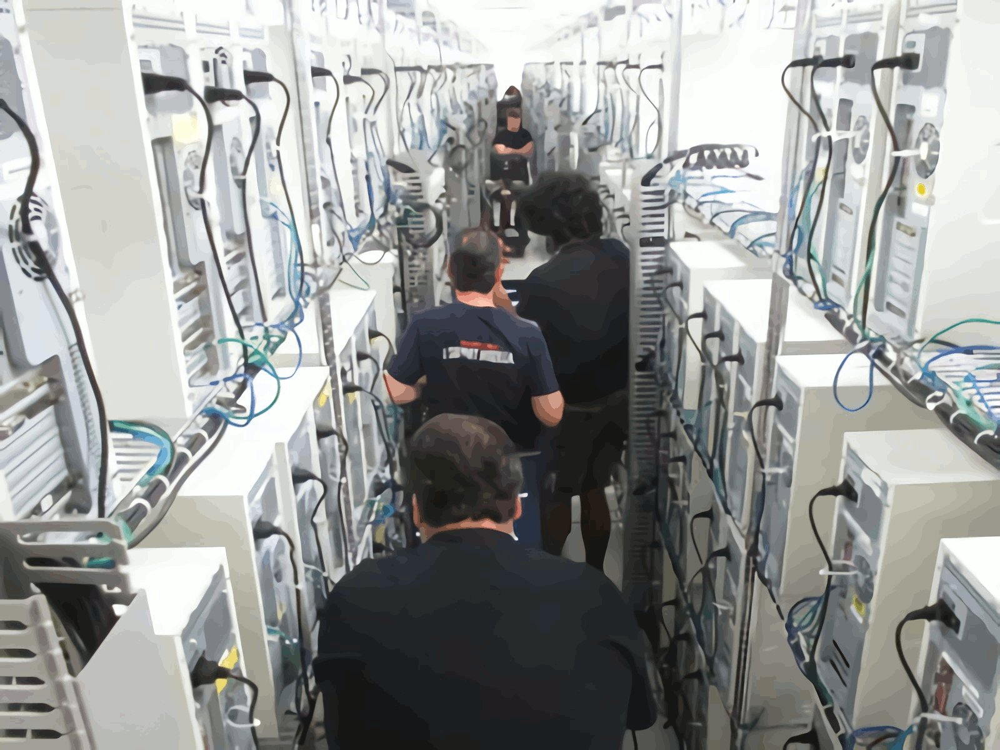
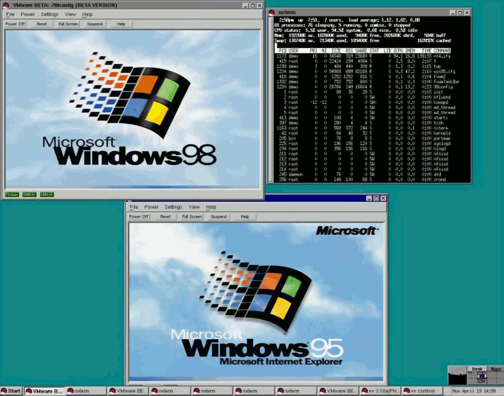
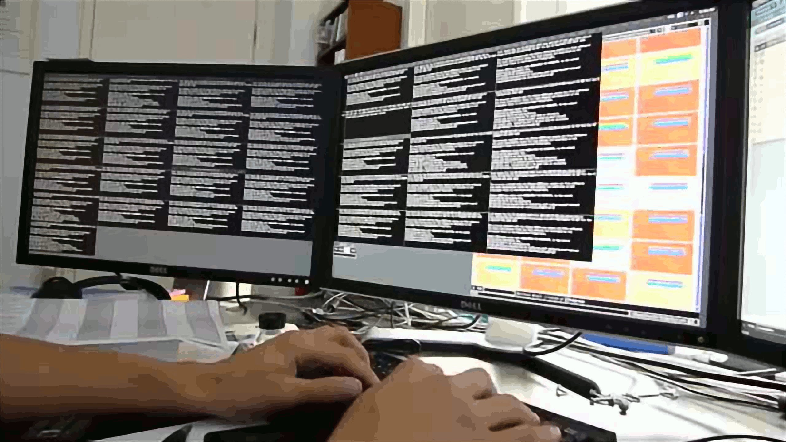
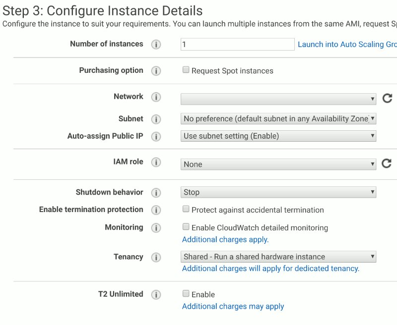

Infrastructure as Code is a bit of a buzzword but it has a simple definition — infrastructure (servers, firewalls, routers, switches, etc) defined, provisioned and managed in versioned files. This is much more manageable and scalable than manually deploying infrastructure, but how did we get here? Well, if you know then you know. But if you don’t (or you want a recap), read on.

## The birth of the SysAdmin

The infamous Rackspace “white boxes” — commodity computers “racked” on kitchen furniture! This image comes from the <a href="https://web.archive.org/web/20180905183558/https://blog.rackspace.com/servers-take-to-the-sky-for-data-center-migration">fascinating blog post</a> describing their server relocation.

Early computer history relied on mainframes (massive, multi-tenant single computers) but quickly moved onto managing dozens, then hundreds of servers. If you wanted to be on the internet around the turn of the century, you would either buy a server or rent one from the then-fledgeling Internet Service Providers. It would be configured with the CPU, RAM and disk space required, plugged into the power and the network, and switched on — it would then be your job to configure it to your requirements.

This wasn’t an unskilled task, and it created massive demand for people who knew how to do all this work. Teams of people would be constantly marching in and out of the Data Centre every time a customer requested a change. It was (and is) very labour intensive.

## The Virtualisation Revolution

VMWare Workstation 1.0 Running Windows 98 and Windows 95 on Red Hat Linux, from a <a href="https://www.virten.net/2015/12/vmware-workstation-from-1999-to-2015/">virten.net blog post</a> on the software’s history.

It’s hard to understate how mind-blowing and revolutionary Virtualisation was, or the effect it had on the IT industry. Instead of configuring hardware on-demand, you could just install the biggest, most powerful beasts you could get your hands on and then sell fractions of a server! And then make those servers smaller, bigger, wider (!). And then create ten of them, and delete them all over again!

Imagine your local pizza shop moving to selling pizza by the slice, and those slices could be any size or shape and with any topping. Oh, and they’re somehow already cooked and ready to pick on-demand. You were fine with a pepperoni pizza, but hey now you could have two slices of pepperoni and a farmhouse, and a bit of calzone to finish it off!

This is exactly what happened. Far from taking pressure off the humble, in-demand SysAdmin, this increased complexity everywhere. Customers that were humming along with 2–3 servers could now buy 20–30 smaller servers, load balance between them and design redundancy, failover and disaster recovery into their architecture. Complex patching schedules emerged from a need to make services more resilient. And, oh, remember that you need to configure all those servers? Well, you actually probably hired a SysAdmin to do that. And he’s so very, very busy.

## Introducing Configuration Management

ClusterSSH, here being <a href="https://www.youtube.com/watch?v=iZElF6GVkjI">demonstrated on YouTube</a>). While it’s a useful tool to get you out of a sticky situation, if you find yourself using it regularly you probably need to start using configuration management tools!

Good SysAdmins responded to this increased complexity by automating away as much as they could. Batch scripts (lists of commands that could be invoked together) could be scheduled to run automatically, and several machines could be connected to at once using tools like ClusterSSH. But these customised, ad-hoc tools could be brittle, so Configuration Management tools like Puppet and Ansible were created.

This finally gave SysAdmins some reprieve by automating away large parts of the complexity of the new architectures they were expected to manage. A web server could be configured once, no matter how many web servers actually existed. An IP address could be changed in one location, and wherever that IP address was referenced it would also change there.

But what about the servers themselves? In this time Data Centres had become a well-oiled, efficient machine. Virtual Servers had become Cloud Servers (which were created automatically and on-demand). And all the while demands became bigger and more complex — create 30 web servers on Wednesday because we have an ad campaign going out, for example, or create a copy of every server we have so we can test some new code. And how do you create new servers?

## We need to Codify our Infrastructure

The AWS EC2 server creation wizard. There are seven pages to fill out.

Cloud services provide an API and many SysAdmins (or **Dev**elopers, who were by this point taking on a lot of **Op**erational tasks) started to write scripts or code that used this API to automate the creation, modification and removal of Cloud Servers. Configuration Management tools started to integrate with these APIs, with some success, creating unified Configuration Management and Infrastructure as Code tools. But changes that take seconds in software can take minutes (sometimes hours) on Infrastructure, so they can’t be treated the same way. Specialised tools were needed.

Terraform is a pure Infrastructure as Code tool. It’s written to create infrastructure and has an opinionated design that (usually) forces you to write code that builds efficient, sensible infrastructure. It allows you to describe like servers once, then use that code to describe a whole environment. You can then write code to deploy many copies of that environment (Test, Staging, Prod, Mike’s experiment, Prod-France, etc). IaC allows you to automate creating the infrastructure, ready for Configuration Management to configure it.

As you can see, Terraform is the next step in a long and storied history of automating away the work of a SysAdmin.